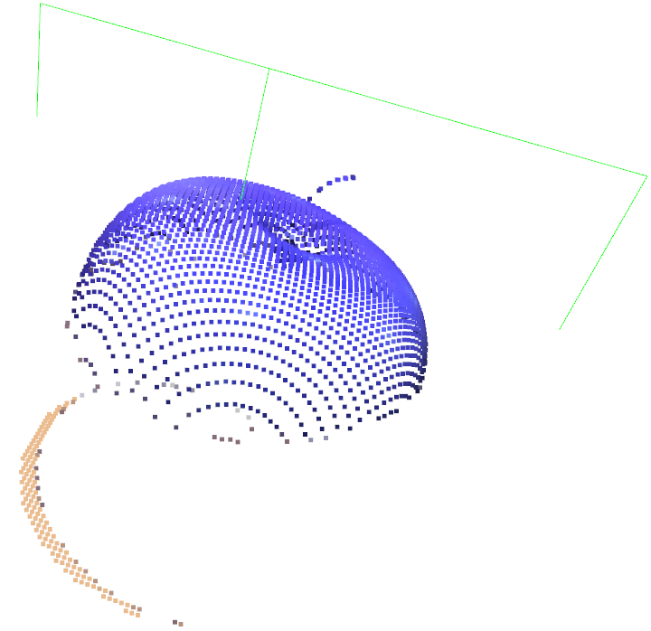

`<a name="readme-top"></a>`

<div align="center">
  
  
  
  
</div>

<h3 align="center">VLM-Robotic-Grasping-and-Planning</h3>

<details>
  <summary>Table of Contents</summary>
  <ol>
    <li>
      <a href="#about-the-project">About The Project</a>
      <ul>
        <li><a href="#core-modules">Core Modules</a></li>
        <li><a href="#key-features">Key Features</a></li>
        <li><a href="#built-with">Built With</a></li>
      </ul>
    </li>
    <li>
      <a href="#getting-started">Getting Started</a>
      <ul>
        <li><a href="#prerequisites">Prerequisites</a></li>
        <li><a href="#installation">Installation</a></li>
      </ul>
    </li>
    <li>
      <a href="#usage">Usage</a>
      <ul>
        <li><a href="#train-rl-path-planner">Train RL Path Planner</a></li>
        <li><a href="#run-simulation">Run Simulation</a></li>
      </ul>
    </li>
    <li><a href="#contact">Contact</a></li>
  </ol>
</details>

---

## About The Project

This project aims to build a simple embodied AI framework **"Semantic Reasoning -> Visual Perception -> Action Execution"**. By integrating VLMs (e.g., Kimi) for scene understanding and target localization, combining SAM (Segment Anything) for zero-shot image segmentation, and utilizing **GRConvnet/GraspNet** to generate grasp poses. Furthermore, classical motion planning libraries (`pyroboplan` and `pinocchio`) and RL-based (`stable_baselines3`) motion planning are integrated to achieve highly complex physical interactions and obstacle-avoidance trajectory planning.

<div align="center">
  
  <p><em>User input: "Give me the red fruit". The robot arm accurately identifies the apple, plans the path, and grasps it.</em></p>

<div align="center">
	
	
  	<p><em>PPO-based rl (left) & RRT- Connect (right) motion planning demonstration.</em></p>
</div>

### **Core Modules**

1. **Input Stage:** The camera captures RGB-D images, combined with text instructions provided by the user.
2. **Multi-modal Reasoning:** Images and instructions are fed into the VLM for deep understanding, extracting the 2D bounding box of the target object.
3. **Precise Segmentation & Pose Generation:** Based on the 2D coordinates, SAM outputs high-quality instance segmentation masks. These are then processed by GraspNet or GRConvNet to calculate the optimal gripper pose.
4. **Motion & Obstacle-Aware Planning:** Given the target grasp pose, inverse kinematics (IK) is solved using `pyroboplan` and `pinocchio`, followed by collision-aware trajectory planning. A hybrid planning framework combining PPO-based reinforcement learning and classical sampling-based methods is used to generate safe trajectories in cluttered environments.
5. **Execution Stage:** The robotic arm strictly follows the planned collision-free trajectory to complete the grasping task.

### Key Features

* **Semantic Reasoning Driven Grasping**

  Integrates a cutting-edge **VLM** to enable high-level semantic reasoning for object manipulation. The system can interpret ambiguous natural language commands and map them to specific objects in the scene (e.g., *"Give me the red fruit"* → identifying and grasping the apple).
* **Precise Vision-to-Grasp Pose Estimation**

  Combines the **SAM segmentation network** with **GraspNet / GRConvNet grasp evaluation** to transform 2D pixel coordinates and depth information into grasp poses in 3D space.

  <div align="center">
    
  <p><em>3D point cloud with grasp pose generated from GRConvNet.</em></p>
  </div>
* **Collision-Aware Motion Planning in Cluttered Environments**

  Implements obstacle-aware trajectory planning using **`pyroboplan`** and  **`pinocchio`** , enabling safe robot motion even in  **space-constrained and highly cluttered desktop environments** . Forward kinematics from Pinocchio are used to compute accurate end-effector states during planning and execution.
* **Collision Checking for Both Robot and Grasped Objects**

  Extends the standard collision checking pipeline to include  **the grasped object attached to the end-effector** , ensuring that both the robot links **and the manipulated object** avoid collisions during motion execution. This significantly improves safety when manipulating objects in tight workspaces.
* **Hybrid Learning + Classical Planning Framework**

  Introduces a **hybrid motion planning architecture** combining:

  * **Reinforcement Learning (PPO)** for fast policy-based trajectory generation in task space
  * **RRT-Connect sampling-based planning** as a reliable fallback mechanism

  If the RL planner fails due to collision or infeasible trajectories, the system automatically falls back to  **RRT-Connect** , ensuring robust path planning under diverse conditions.

### Built With

This project is built using the following outstanding open-source projects and frameworks:

* [Segment Anything (SAM)](https://github.com/facebookresearch/segment-anything)
* [GraspNet](https://graspnet.net/)
* [GRConvNet](https://github.com/skumra/robotic-grasping)
* [Pyroboplan](https://github.com/sea-bass/pyroboplan)
* [Pinocchio](https://github.com/stack-of-tasks/pinocchio)
* [stable-baselines3](https://github.com/DLR-RM/stable-baselines3)

<p align="right">(<a href="#readme-top">back to top</a>)</p>

---

## Getting Started

Follow these instructions to set up the project locally.

### Prerequisites

* Python 3.10
* numpy 1.26.4

### Installation

1. Clone the repository

   ```bash
   git clone [https://github.com/Ananasburn/VLM-Robotic-Grasping-and-Planning.git](https://github.com/Ananasburn/VLM-Robotic-Grasping-and-Planning.git)
   cd VLM-Robotic-Grasping-and-Planning
   ```
2. Create a virtual environment (you can change the name inside the file)

   ```
   conda env create -f environment.yml
   ```
3. Deploy `grconvnet` and Train Model

   Clone `grconvnet` into the current project:

   ```bash
   git clone https://github.com/skumra/robotic-grasping.git grconvnet
   ```

   Afterward, you can train a new model following the official guidelines of that repository.

   > **Note**: If you choose to train using the open-source dataset provided by that repository, make sure to change the background of target objects in your simulation environment to **light colors**, otherwise it will significantly affect the model's prediction performance. Of course, you can also completely use your own dataset for training.
   >

## Usage

### Train RL Path Planner

A PPO-based reinforcement learning algorithm  is used to perform collision-free path planning in the task space (for the placing phase). You can start the training process using the following command:

```bash
python manipulator_grasp/rl_path_planner/train_task_space.py --name task_space_v1 --envs 8 --timesteps 2000000 --visualize
```

**Arguments:**

* `--name`: Sets the experiment name, which will be used for the TensorBoard logs path and the saved model's name.
* `--envs`: The number of parallel environments to run. Using multiple parallel environments (`SubprocVecEnv`) can effectively accelerate experience data collection and speed up training.
* `--timesteps`: Total training timesteps for the model.
* `--visualize`: Whether to enable the MuJoCo simulation GUI during training. Adding this flag activates a hybrid mode based on `HybridVecEnv`, which only visualizes the main process environment (`env_0`), while the remaining environments continue high-efficiency computation in the background.
* `--max-steps`: The maximum allowed steps per single episode. When exceeded, the environment will automatically reset.
* `--resume`: Specifies a model path to resume training from. If a previous `.zip` model path is provided, the environment will load its past parameters and states to continue training.

### Run Simulation

To execute the complete pipeline including Visual-Language reasoning, grasp pose generation, and path planning within the MuJoCo simulation environment, run the primary entry point script:

```bash
python main_vlm.py --planner rl_ppo --grasp_model grconvnet --target apple
```

**Arguments:**

* `--planner`: Selects the motion planner to be used for the robot trajectory. Options are `rrtconnect` (traditional sampling-based planner, default) or `rl_ppo` (the trained Reinforcement Learning policy).
* `--grasp_model`: Specifies which grasp synthesis model will generate the 6-DoF gripper pose from the segmented point cloud. Choices are `graspnet` (GraspNet-baseline, default), `grconvnet` (GR-ConvNet).
* `--target`: Defines the natural language name of the target object you want the robot to manipulate (e.g., `apple`). When specified, the system will save the grasp model's prediction visualizations to the `Img_grasping/{target}_gg/` directory.
* `--manual_select`: If added, this flag skips the automated VLM semantic inference step and allows you to manually select the target object by mouse-clicking on it in the generated image.

## Contact

wayneweim@gmail.com
